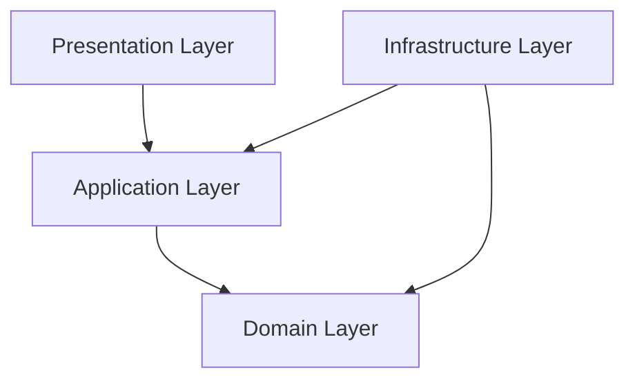

# Sistema de Gestión de Gimnasio (TPI) - API Backend

Este repositorio contiene la API REST para el **Sistema de Gestión de Gimnasio**, desarrollada en **.NET** siguiendo los principios de **Clean Architecture** (Arquitectura Limpia). Permite administrar múltiples sedes, membresías (planes), clases, horarios e inscripciones, además de gestionar la autenticación y pagos externos.

---

## 🛠️ Arquitectura del Proyecto

El sistema está estructurado bajo **Clean Architecture**, dividiéndose en las siguientes capas dentro del directorio `Src/`:



1. **Domain (Dominio):**
   * Contiene las entidades principales del negocio: `User` (y sus derivados `Client`, `Admin`, `SysAdmin`), `Plan`, `Class`, `Schedule` e `Inscription`.
   * Define las interfaces (`Domain.Interface`) de los repositorios y servicios externos (ej. `IUserRepository`, `IMercadoPagoService`), asegurando el desacoplamiento.
2. **Application (Aplicación):**
   * Implementa la lógica de negocio a través de servicios (`Application.Services`).
   * Contiene los Data Transfer Objects (`Application.Dtos`), mapeos (`Application.Mapper`), excepciones personalizadas (`Application.Exceptions`) e interfaces correspondientes.
3. **Infrastructure (Infraestructura):**
   * Implementa el acceso a datos mediante Entity Framework Core (`ApplicationDbContext`) con soporte de migraciones para SQL Server.
   * Contiene la implementación de repositorios (`Infraestructure.Repositories`).
   * Maneja integraciones externas y servicios transversales en `Infraestructure.Service`:
     * **Autenticación (JWT):** Generación y validación de tokens de sesión.
     * **Envío de Emails (SMTP):** Envío de correos para verificación de cuentas y recuperación de contraseñas.
     * **Pasarela de Pagos (Mercado Pago):** Integración con el API de Mercado Pago.
     * **Tareas en Segundo Plano (Hosted Services):** El servicio `SubscriptionBackgroundService` corre en background controlando periódicamente la expiración de las suscripciones de los clientes.
4. **Presentation (Presentación):**
   * Es el punto de entrada de la aplicación (ASP.NET Core Web API).
   * Contiene los controladores que exponen los endpoints REST bajo `Presentation.Controller`.
   * Configura la seguridad (Autenticación JWT y políticas de Autorización por roles en `Program.cs`).
   * Implementa un Middleware global para el manejo unificado de excepciones (`ExceptionHandlingMiddleware`).

---

## 🔑 Características Técnicas Clave

* **Autenticación y Autorización Basada en Roles:**
  * Implementa JWT Bearer authentication.
  * Define políticas de acceso granulares:
    * `SoloAdmin`: Rol *Admin*.
    * `SoloClient`: Rol *Client*.
    * `SoloSysAdmin`: Rol *SysAdmin*.
    * `AdminOSysAdmin`: Roles *Admin* o *SysAdmin*.
* **Resiliencia con Polly:**
  * Las llamadas a la API de **Mercado Pago** se encuentran protegidas en el cliente HTTP (`HttpClient`) a través de políticas de resiliencia (`Microsoft.Extensions.Http.Resilience`):
    * **Retry Pattern:** 3 intentos con backoff exponencial.
    * **Circuit Breaker:** Abre el circuito si el ratio de fallos alcanza el 10% en un intervalo de 30 segundos.
    * **Timeout:** Límite de 30 segundos por petición.
* **Base de Datos Embebida / Seed:**
  * Al iniciar el servidor, un seeder automático (`DatabaseSeeder`) crea la base de datos (si no existe) y siembra un usuario `SysAdmin` por defecto.
* **Documentación con Swagger:**
  * API autodocumentada con soporte nativo de autenticación JWT Bearer directamente desde la interfaz de Swagger UI.

---

## 🚀 Cómo Ejecutar el Proyecto

### Requisitos Previos
* [.NET 8.0 SDK](https://dotnet.microsoft.com/download) o superior.
* Instancia de [SQL Server](https://www.microsoft.com/sql-server/) activa.

### Pasos
1. Clonar el repositorio.
2. Configurar la cadena de conexión en el archivo `Src/Presentation/appsettings.json`:
   ```json
   "ConnectionStrings": {
     "DefaultConnection": "Server=TU_SERVIDOR;Database=GimnasioDb;Trusted_Connection=True;TrustServerCertificate=True;"
   }
   ```
3. Configurar las credenciales SMTP para el envío de correos en la sección `EmailSettings` de `appsettings.json`.
4. Posicionarse en la carpeta del proyecto de presentación (`Src/Presentation/`) y ejecutar el comando:
   ```bash
   dotnet run
   ```
5. Acceder a Swagger en: `http://localhost:PORT/swagger` (el puerto dependerá de la configuración en `launchSettings.json`).

---

Trabajo en progreso: Se planea agregar soporte para pruebas unitarias e integración, así como la implementación de un cliente frontend para consumir esta API.

Esta api fue realizada por los alumnos de la carrera de Tecnicatura Universitaria en Programación de la Universidad Tecnológica Nacional (UTN) 2026,

integrantes: -Maximo hahn 
             -Augusto Magi 
             -Nahuel Dallavale 
             -Joaquin Sanchez

